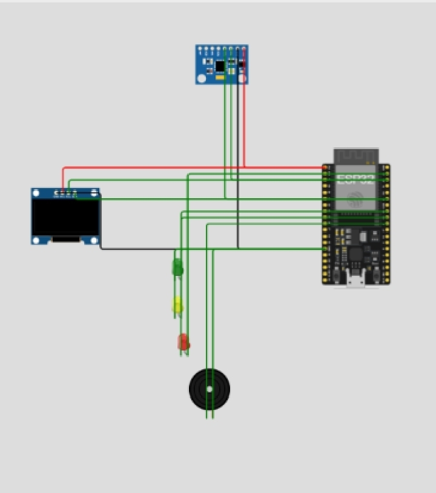

# Structural-Health-Monitoring-System
An ESP32-based structural health monitoring prototype using an MPU6050 sensor, hysteresis, and Bluetooth communication.

# Structural Health Monitoring System

## Overview

The Structural Health Monitoring System is a prototype developed using an ESP32 and an MPU6050 motion sensor to monitor movement and detect conditions that exceed predefined thresholds.

The system provides visual and audible alerts and also incorporates Bluetooth communication for wireless monitoring. Hysteresis was implemented to improve the stability of the threshold-based detection system.

This project was developed as a practical embedded systems project, combining sensor interfacing, microcontroller programming, circuit prototyping, and hardware-software integration.

---

## Objectives

* Monitor structural movement using an MPU6050 sensor.
* Process sensor readings using an ESP32.
* Detect conditions that exceed predefined thresholds.
* Implement hysteresis to reduce unstable switching around threshold values.
* Provide visual and audible alerts.
* Implement Bluetooth communication for wireless monitoring.
* Gain practical experience in embedded systems and hardware-software integration.

---

## Hardware Components

| Component        | Purpose                                       |
| ---------------- | --------------------------------------------- |
| ESP32            | Main microcontroller and processing unit      |
| MPU6050          | Measures acceleration and rotational movement |
| OLED Display     | Displays system information                   |
| LEDs             | Provides visual status indication             |
| Buzzer           | Provides audible alerts                       |
| Resistors        | Used for circuit connections and protection   |
| Power Supply     | Provides power to the system                  |
| Breadboard       | Used for circuit prototyping                  |
| Connecting Wires | Used to connect the components                |

---

## System Architecture

The basic system flow is:

**MPU6050 → ESP32 → Processing & Decision Logic → OLED / LEDs / Buzzer**

The ESP32 also provides **Bluetooth communication** for wireless monitoring.

---

## Hardware Setup

The components were connected to the ESP32 and tested individually before integrating them into the complete prototype.

### Wiring

---

## How It Works

The MPU6050 continuously provides motion-related readings to the ESP32.

The ESP32 processes the sensor data and compares the readings against predefined threshold values.

When a monitored condition exceeds the specified threshold, the system responds using the connected indicators.

Hysteresis was implemented to prevent the system from repeatedly switching between states when sensor readings fluctuate around a threshold.

The OLED provides local information, while the LEDs and buzzer provide additional visual and audible feedback.

Bluetooth communication was also implemented to allow wireless communication with the system.

---

## Software

* **Programming Language:** C++
* **Development Environment:** Arduino IDE
* **Microcontroller:** ESP32
* **Motion Sensor:** MPU6050
* **Wireless Communication:** Bluetooth

---

## Development Process

The project was developed through several stages:

1. Set up and tested the ESP32.
2. Connected and tested the MPU6050 sensor.
3. Verified the sensor readings.
4. Integrated the OLED display and alert components.
5. Developed the monitoring and threshold logic.
6. Implemented hysteresis.
7. Implemented Bluetooth communication.
8. Integrated the complete system.
9. Tested and debugged the prototype.
10. Demonstrated the completed system.

---

## Challenges Encountered

Some of the challenges during development included:

* Establishing reliable communication between the ESP32 and MPU6050.
* Troubleshooting wiring and power connections.
* Testing and interpreting sensor readings.
* Integrating multiple hardware components into one system.
* Debugging unexpected behaviour during testing.

These challenges provided practical experience in systematic hardware and software troubleshooting.

---

## What I Learned

Through this project, I gained practical experience with:

* ESP32 microcontrollers
* C++ programming
* MPU6050 sensors
* Sensor data processing
* Threshold-based decision making
* Hysteresis
* Bluetooth communication
* Circuit prototyping
* Hardware-software integration
* Debugging and testing

---

## Project Demonstration

A video demonstrating the completed prototype is included in this repository.

**[▶ View Project Demonstration](Videos/project-demo.mp4)**

---

## Future Improvements

Possible improvements to the prototype include:

* Adding multiple sensors at different points on a structure.
* Implementing data logging for long-term monitoring.
* Developing a web or mobile monitoring dashboard.
* Improving the classification of structural conditions.
* Adding remote wireless monitoring.
* Designing a more compact and permanent hardware version.

---

## Project Status

**Completed Prototype**

This project demonstrates the integration of an ESP32, motion sensing, threshold-based monitoring, hysteresis, Bluetooth communication, and multiple output indicators into a functional prototype.
